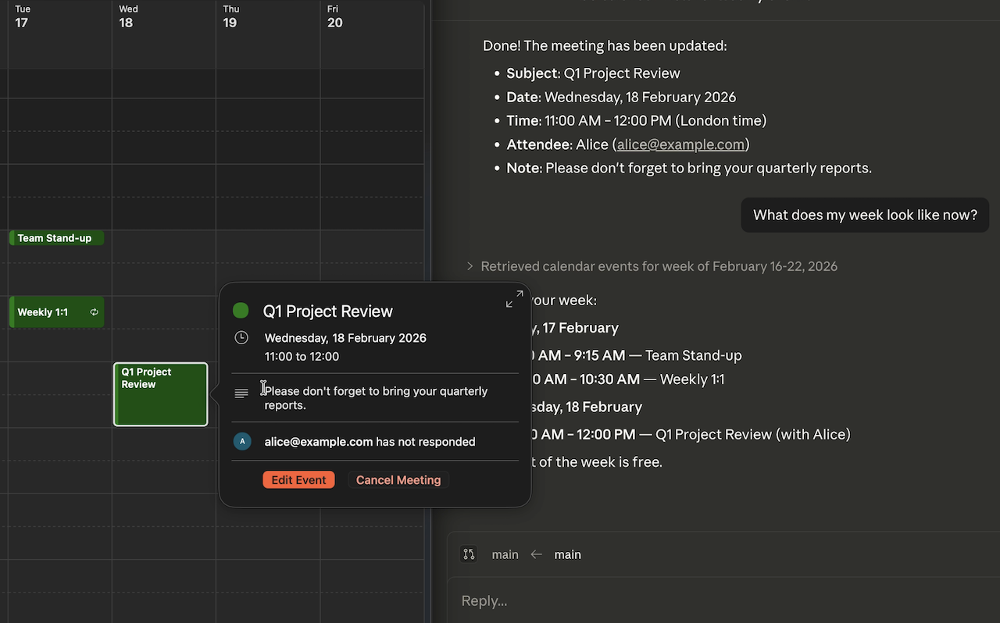

# Office Assistant



Manage Office 365 calendars by chatting in plain English. Just type what you need -- **"What's on my calendar today?"**, **"Schedule a meeting with Alice tomorrow at 2pm"**, **"Find a time that works for everyone"** -- and the assistant handles the rest.

Built for executive assistants and anyone who manages busy calendars, Office Assistant connects to Microsoft 365 and lets you create events, check availability, book rooms, manage other people's calendars, and more -- all through a simple chat interface.

---

## What you can do

Once set up, just open Claude Code in the `office-assistant` folder and start typing. Here's what you can ask:

### View your schedule

```
What's on my calendar today?
Show me my meetings for next week
What do I have on Thursday?
```

### View someone else's calendar

```
What's on Alice's calendar tomorrow?
Show me bob@company.com's schedule for Monday
```

> The other person needs to have shared their calendar with you in Outlook for this to work.

### Create meetings

```
Schedule a meeting called "Project Review" tomorrow at 3pm
Book a 1-hour meeting with alice@company.com and bob@company.com on Friday at 10am
Set up a meeting about budget planning next Tuesday at 2pm in the Board Room
```

Meetings include a Microsoft Teams link by default. If you want an in-person meeting, just say so:

```
Schedule an in-person meeting in Room 4A tomorrow at 11am
```

### Change or cancel meetings

```
Move the Project Review to 4pm
Cancel tomorrow's budget meeting
Cancel the 3pm meeting and let everyone know it's been postponed
```

### Recurring meetings

```
Set up a daily standup at 9am starting Monday
Schedule a weekly team sync every Tuesday and Thursday at 2pm for the next 3 months
Create a monthly budget review on the first Monday of each month
```

### Accept or decline meetings

```
Accept the meeting invitation from Alice
Decline tomorrow's 3pm meeting with a note that I have a conflict
Tentatively accept the project review
```

### Manage someone else's calendar

If someone has granted you delegate access in Outlook, you can manage their calendar:

```
Schedule a meeting called "Board Review" on Sarah's calendar for Friday at 10am
Cancel the 2pm meeting on my manager's calendar
Accept the invitation on behalf of sarah@company.com
```

> To grant delegate access: in Outlook, the other person goes to **File** > **Account Settings** > **Delegate Access** > adds your email address.

### Check availability

```
Is alice@company.com free tomorrow afternoon?
Check if bob@company.com and carol@company.com are available on Thursday
```

### Find a time that works for everyone

```
Find a time for a 30-minute meeting with alice@company.com next week
When can bob@company.com, carol@company.com and I all meet for an hour?
```

### Book a meeting room

```
What meeting rooms are available?
Show me rooms in Building 2
Book the Boardroom for tomorrow's team meeting at 3pm
```

### Shortcut commands

You can also type these shortcuts to be guided step by step:

| Command | What it does |
|---------|-------------|
| `/calendar` | Answer questions about your calendar |
| `/schedule-meeting` | Walk you through creating a meeting step by step |
| `/find-time` | Find available meeting slots across multiple people |
| `/check-availability` | Check if people are free or busy |
| `/calendar-setup` | Help with signing in or fixing connection issues |

### Personal accounts

If you're using a personal Microsoft account (@outlook.com, @hotmail.com), most features work -- including viewing your calendar, creating and managing events, recurring meetings, and accepting or declining invitations. A few features are only available with work/school accounts: checking other people's availability, viewing other people's calendars, delegate calendar access, and meeting room discovery.

---

## Getting started

Setting up takes about 10 minutes. You'll install the software, register an app in the Azure portal, and sign in. If any of this feels unfamiliar, your IT department can help -- especially with the Azure registration step.

### What you'll need

- **A computer** running Windows, macOS, or Linux
- **A Microsoft account** -- either a work/school account (Office 365) or a personal account (@outlook.com, @hotmail.com)
- **Claude Code** -- [installation guide](https://docs.anthropic.com/en/docs/agents-and-tools/claude-code/overview)

You do **not** need to install Python or any other programming tools -- the setup script handles everything automatically.

### Step 1: Install the assistant

Open a terminal and run these three commands:

```bash
git clone https://github.com/rgilks/office-assistant.git
cd office-assistant
./setup.sh
```

<details>
<summary><strong>How do I open a terminal?</strong></summary>

- **Windows**: Press the Windows key, type **Terminal** or **PowerShell**, and open it. If you have WSL (Windows Subsystem for Linux) installed, open it by typing **wsl** in the Start menu. If you're not sure whether you have WSL, ask your IT department -- they can install it for you in a few minutes.
- **Mac**: Press **Cmd + Space**, type **Terminal**, and press Enter.
- **Linux**: Press **Ctrl + Alt + T** or look for Terminal in your applications menu.

</details>

<details>
<summary><strong>Windows users: about WSL</strong></summary>

Office Assistant runs inside WSL (Windows Subsystem for Linux), which gives you a Linux environment on your Windows PC. Most modern Windows work computers already have this installed. To check, open PowerShell and type `wsl --status`. If it's not installed, your IT department can set it up by running `wsl --install` in an administrator PowerShell -- it takes about 5 minutes and requires one restart.

Once WSL is set up, open it from the Start menu and run the install commands above inside the WSL terminal.

</details>

The setup script will automatically install all the software dependencies and walk you through the sign-in process. If you see any errors, jump to [Troubleshooting](#troubleshooting) below.

### Step 2: Register an app in Azure

This step tells Microsoft that the Office Assistant is allowed to access calendars on your behalf. You only need to do this once. If your organisation restricts Azure access, ask your IT department to do this step for you.

1. Go to **[portal.azure.com](https://portal.azure.com)** in your web browser
2. Sign in with your **Microsoft account** (work, school, or personal)
3. In the search bar at the top, type **App registrations** and click the result
4. Click the **+ New registration** button
5. Fill in the form:
   - **Name**: `Office Assistant`
   - **Supported account types**: choose based on your account:
     - **Work/school account**: "Accounts in this organizational directory only"
     - **Personal account** (@outlook.com, @hotmail.com): "Personal Microsoft accounts only"
   - **Redirect URI**: leave this blank
6. Click **Register**

You'll now see an overview page for your new app:

7. Copy the **Application (client) ID** -- it looks like `a1b2c3d4-e5f6-7890-abcd-ef1234567890`. You'll need this in the next step.

Now configure two more settings:

8. In the left sidebar, click **Authentication**
   - Scroll down to **Advanced settings**
   - Set **Allow public client flows** to **Yes**
   - Click **Save** at the top

9. In the left sidebar, click **API permissions**
   - Click **+ Add a permission**
   - Click **Microsoft Graph**
   - Click **Delegated permissions**
   - Search for and tick these permissions:
     - `Calendars.ReadWrite`
     - `Calendars.ReadWrite.Shared` (work/school accounts only -- skip for personal accounts)
     - `Place.Read.All` (work/school accounts only -- enables meeting room discovery)
     - `User.Read`
   - Click **Add permissions**

### Step 3: Sign in

If the setup script from Step 1 didn't already walk you through this, run the sign-in command:

```bash
cd office-assistant
uv run python -m office_assistant.setup
```

It will ask you for:
- Your **Application (client) ID** (from step 7 above)
- Whether you're using a **work/school** or **personal** account

Then it will show a sign-in message like:

> To sign in, use a web browser to open https://microsoft.com/devicelogin and enter the code **ABCD1234**

1. Open that link in your browser
2. Enter the code shown
3. Sign in with your Microsoft account
4. Approve the permissions when asked

That's it! Your login is saved for about 90 days, so you won't need to do this again for a while. When it expires, just use any calendar command and it will prompt you to sign in again.

---

## Troubleshooting

### "CLIENT_ID and TENANT_ID must be set"

The configuration file is missing or incomplete. Run `uv run python -m office_assistant.setup` to set it up interactively.

### "Could not start device-code flow"

Your Azure app may not have public client flows enabled. Go back to Azure Portal > App registrations > your app > Authentication, and make sure "Allow public client flows" is set to **Yes**.

### "You don't have permission to view this person's calendar"

The other person hasn't shared their calendar with you. Ask them to share it: in Outlook, they go to **Calendar** > right-click their calendar > **Sharing and Permissions** > add your email address.

### "ErrorAccessDenied" on any calendar operation

The Azure app is missing the required permissions. Go to Azure Portal > App registrations > your app > API permissions and check that the right permissions are listed (see Step 2 above).

### "Approval required" or admin consent screen

Your organisation requires an admin to approve apps that access calendar data. You have two options:

1. **Ask your IT admin** to grant consent for the app in the Azure portal
2. **Use a personal Microsoft account** (@outlook.com, @hotmail.com) instead -- register a new app under that account and sign in with it

### The login expired

Just use any calendar command and it will automatically refresh. If the refresh token has also expired (after ~90 days), you'll be prompted to sign in again with the device code flow.

### Something else isn't working

Type `/calendar-setup` in Claude Code -- it will check your connection and guide you through fixing common issues.

---

## For developers

### Architecture

- **MCP server** (`src/office_assistant/server.py`): FastMCP over stdio, provides calendar tools to Claude Code
- **Tools** (`src/office_assistant/tools/`): Calendar operations, availability checks, room booking
- **Auth** (`src/office_assistant/auth.py`): MSAL device code flow, tokens cached at `~/.office-assistant/`
- **Skills** (`.claude/skills/`): Slash command definitions

### Development setup

```bash
git clone https://github.com/rgilks/office-assistant.git
cd office-assistant
uv sync --extra dev
```

### Running tests

```bash
uv run pytest
```

### Linting

```bash
uv run ruff check src/ tests/
uv run ruff format --check src/ tests/
```
